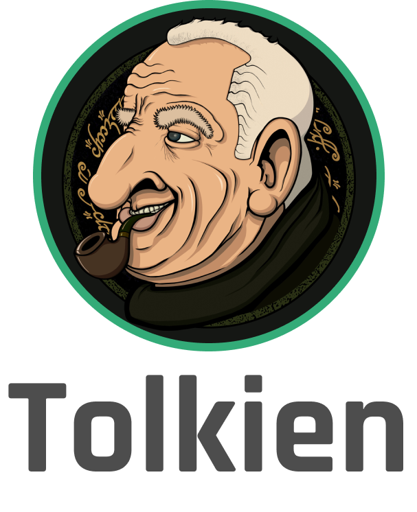

<div>
    <p align="center">
        
    </p>
    <hr>
    <blockquote align="center">
        "Running gives freedom. When you run you can determine your own tempo. You can choose your own course and think whatever you want. Nobody tells you what to do." - Nina Kuscsik
    </blockquote>
</div>

<br>

<p align="center">
  <a href="https://badge.fury.io/js/@joggr%2Ftempo">
    
  </a>
  <a href="https://github.com/joggrdocs/tempo/actions/workflows/github-code-scanning/codeql">
    
  </a>
  <a href="https://github.com/joggrdocs/tempo/actions/workflows/npm-publish.yaml">
    
  </a>
  <a href="https://github.com/joggrdocs/tempo/actions/workflows/ci.yaml">
    
  </a>
  <br/>
  <a href="https://github.com/standard/semistandard">
    
  </a>
  <a href="https://github.com/prettier/prettier">
    
  </a>
</p>

## Overview

Library used to programmatically build markdown documents, with a heavy tilt toward [GitHub Flavored Markdown (GFM)](https://github.github.com/gfm/).

## Getting Started

Install the library and you can begin to use it in your application(s).

_This is a Github Package and your application must support installing internal Github packages before you can use this package._

**npm**

```shell
npm install @joggrdocs/tempo
```

**yarn**

```shell
yarn add @joggrdocs/tempo
```

## Usage

```typescript
import fs from 'node:fs/promises';
import tempo from '@joggrdocs/tempo';

const result = tempo()
  .h1('Hello World')
  .paragraph('Some things')
  .paragraph((txt) => 
    txt
      .plainText('A sentence with')
      .bold('bolded words')
      .plainText('and')
      .italic('italicized words')
      .plainText('.', { append: true })
      .build()
  )
  .h2((txt) => 
    txt 
      .plainText('A')
      .italic('table')
  )
  .table([
    ['name', 'email'],
    ['Zac', 'zac@acmecorp.com']
  ])
  .toString();

fs.writeFile('myFile.md', result)
  .then(() => {
    console.log('DONE');
  });
```

## Serialized Data (⚠️ Unstable API ⚠️)

Tempo creates a syntax tree that can be serialized and stored in a data base.

```typescript
import db from 'db/orm';
import tempo from '@joggrdocs/tempo';

const result = tempo()
  .h1('Hello World')
  .paragraph('Some things')
  .paragraph((txt) => 
    txt
      .plainText('A sentence with')
      .bold('bolded words')
      .plainText('and')
      .italic('italicized words')
      .plainText('.', { append: true })
      .build()
  )
  .toJSON();

// Example of storing a serializable data object to the DB
await db.collection('tempoDoc').findAndSave(1, result);
```

### Credits

- Logo by [Time management icons created by Freepik - Flaticon](https://www.flaticon.com/free-icons/time-management)
